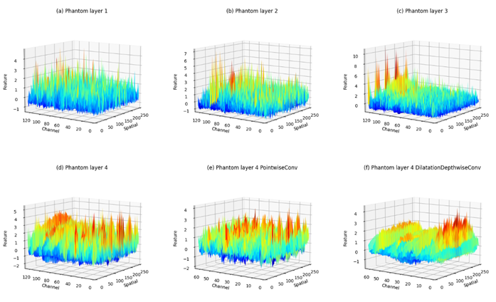
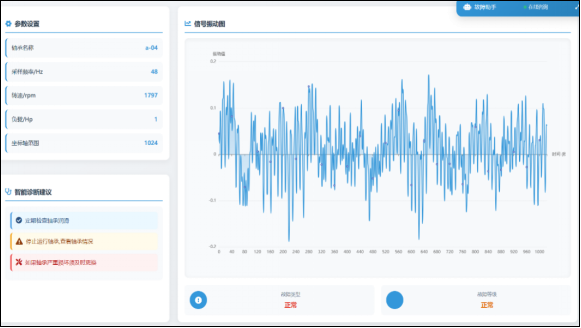

<ProjectHero 
  title="智眸探微：赋能工业智能的轴承故障诊断系统"
  subtitle="BEARING FAULT DIAGNOSIS SYSTEM & AI EXPLORATION"
  date="2025.10 - 2026.03"
  role="核心算法开发 & 全栈集成"
  :honors="[
    '挑战杯“人工智能+”专项赛省级奖项',
    '国家版权局软件著作权 4 项',
    '发明专利申请中'
  ]"
>
</ProjectHero>

## 💡 项目背景与行业痛点

在现代工业生产中，轴承作为各类旋转机械设备的核心部件，长期处于高速、重载、高温等严苛工况下，极易发生疲劳、磨损等故障。传统业界普遍依赖技术人员的人工检测或基础时域分析，面临三大核心痛点：

* **高昂的非计划停机成本**：一旦轴承故障引发整个设备的非计划停机，将给企业带来巨大的经济损失与生产延误。
* **传统诊断的滞后性与局限性**：依赖人工巡检不仅耗时耗力，诊断结果也深受主观经验影响，难以捕捉早期微弱的故障特征。
* **边缘环境算力严重受限**：传统的深度学习模型往往参数量庞大、计算资源需求极高，难以在工业现场资源受限的边缘计算设备（Edge Devices）上进行实时部署与高效运行。

本项目致力于打造一套**非接触式、高精度、端到端**的工业智能化预知性维护解决方案。

---

## ⚙️ 核心算法突破：轻量化抗噪模型 (MSLCNN)

为解决强噪声环境与边缘算力受限的矛盾，本项目摒弃了笨重的传统模型，自主研发了具有极强环境自适应能力的 **MSLCNN (Multi-Scale Lightweight CNN)** 模型。

### 1. 多尺度并行特征提取
传统单一尺寸的卷积核难以同时捕捉高频的瞬态冲击与低频的稳态磨损信号。我们在网络前端设计了多行并行的连接拓扑，每行使用不同感受野大小的卷积核（如 1x1, 3x3, 5x5），实现对原始振动信号的多尺度特征提取，确保不同粒度的故障信息零遗漏。

### 2. Ghost 模块：高维特征的低成本生成
为了在极致压缩模型体积的同时保持特征丰度，系统引入了 **Ghost 结构**。通过少量基础卷积生成内在特征图，再应用一系列廉价的线性变换（点卷积与膨胀卷积结合）生成冗余特征。这使得模型在计算开销极低的情况下，依然能获取更丰富、更高维度的深层特征。

### 3. ECA 通道注意力机制
工业现场充斥着电磁与机械强噪声。我们在模型深层集成了 **ECA (Efficient Channel Attention)** 机制。它通过一维卷积实现局部跨通道交互，自主学习并赋予不同特征通道动态权重。模型能“聪明地”聚焦于包含故障特性的关键通道，大幅抑制背景噪声的干扰。

  
  
图 1：多尺度特征与通道注意力热度分布可视化验证

---

## 🤖 工业认知革命：DeepSeek 决策智能体

除了底层的视觉与信号识别，本系统在应用层接入了强大的大语言模型，实现了从“自动发现问题”到“输出维修决策”的真正闭环。

### 1. 业务流程与 MES 自动化联动
* 当底层 MSLCNN 捕捉到异常信号时，系统通过实时计算评估故障置信度，并触发三级递进式预警。
* 预警信号通过 API 直接打通企业内部的 **MES（制造执行系统）**。系统会自动拉取对应型号轴承的备件库存、定位设备台账，并生成初步的维保工单，实现零人工干预的自动化流转。

### 2. 交互式智能维保助手 (RAG)
* 我们利用 **LangChain 框架与 Coze 平台**，挂载了本地的《轴承维保手册》、《历史故障分析库》等私有化数据集，搭建了垂直领域的工业信号知识库。
* 结合 **DeepSeek 大模型**强大的推理与文本生成能力，一线维保工人只需在平板端输入自然语言（如：“2号机组高频异响该怎么处理？”），智能体即可根据当前特征数据，输出精确的故障原因深度分析及排查步骤，极大降低了工业维保的专业门槛。

---

## 📊 实验数据与消融验证

为了验证模型的实战能力，我们在标准数据集上人为注入了不同信噪比（SNR）的高斯白噪声，模拟真实的恶劣工业环境，并与其他主流算法进行了严格的对照测试：

**不同强噪声环境下的诊断准确率对比：**

| 模型方法 | 0db 噪声 | -4db 噪声 | -8db 噪声 (极强干扰) | 参数量/体积 |
| :--- | :--- | :--- | :--- | :--- |
| **MSLCNN (本项目)** | **0.998** | **0.985** | **0.950** | **~12MB** |
| MIXCNN | 0.990 | 0.980 | 0.890 | 中 |
| MADCNN | 0.980 | 0.940 | 0.830 | 大 |
| WDCNN | 0.960 | 0.850 | 0.650 | 大 |

> 🏆 **核心技术结论**：测试结果表明，随着环境噪声的加剧，传统算法性能呈断崖式下跌；而本系统（MSLCNN）在极端强噪声（-8db）下，诊断精度仍保持在 95% 以上，比传统算法**提升了 40%**。同时，模型解析速度**提升了 50%**，真正实现了高精度与轻量化的完美平衡。

---

## 💻 平台功能模块与工程落地

我们利用全栈技术开发了支持设备全生命周期健康管理的线上平台，作为系统的核心管控中枢：

1. **非接触式实时监测大盘**：详细展示非接触传感器传回的温度、转速、振动频率等实时物理参数，并配有极低延迟的高精度波形图。
2. **设备数字孪生档案**：支持快捷上传新设备建档，全天候追踪使用年限与安装位置，构建设备的数字生命周期模型。

---

## 🚧 工程挑战与应对策略

* **极限工况泛化难题**：面对训练集未覆盖的极端异常模式，我们建立了增量学习管道。通过持续收集现场 Long-tail 数据回流训练，辅以数据增强策略，不断拓宽模型的识别边界。
* **多智能体协作稳定性**：在分布式部署中，智能体间通信偶发延迟。我们重新设计了基于微服务的异步通信协议，并加入了断线重连与冗余故障恢复机制，确保了工业级 99.9% 的系统高可用性。

## 🏆 项目证书与运行展示

  
  

> 💡 **系统完整性说明**：
> 限于展示篇幅，本页仅截取核心技术落地与高频交互界面。系统实际上还包含完整的后台管控大盘、RBAC 权限分配、全维度系统监控以及基础的 CRUD 等 20+ 个功能视窗。完整系统运转细节，欢迎通过左侧导航栏查阅对应的 GitHub 源码库。