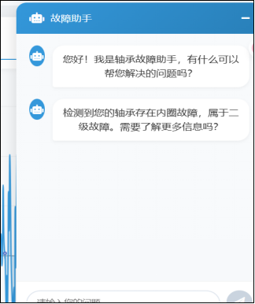

<ProjectHero 
  title="轴承故障诊断系统"
  subtitle="BEARING FAULT DIAGNOSIS SYSTEM & AI EXPLORATION"
  date="2025.10 - 2026.03"
  role="核心算法开发 & 全栈集成"
  :honors="[
    '河南省创新创业大赛省级二等奖',
    '第18届计算机设计大赛省级三等奖',
    '国家版权局软件著作权登记'
  ]"
>
  
</ProjectHero>

## 项目背景与行业痛点

在现代工业生产中，轴承作为各类旋转机械设备的核心部件，长期处于高速、重载、高温等严苛工况下，极易发生疲劳、磨损等故障。

* **高昂的停机成本**：一旦轴承故障引发整个设备的非计划停机，将给企业带来巨大的经济损失与生产延误。
* **传统诊断的局限性**：目前业界普遍依赖技术人员的人工检测，不仅耗时耗力，诊断结果也深受主观经验影响，难以实现故障的早期精确预警。
* **边缘环境算力受限**：传统的深度学习模型往往计算资源需求大，难以在工业现场资源受限的边缘计算设备上高效部署。

## 核心技术架构与算法创新

本项目摒弃了依赖人工判断的传统诊断方式，采用深度学习与大模型构建非接触式诊断底座，大幅提升了系统的鲁棒性与精度。

**(后面的 Markdown 内容保持不变即可...)**

### 1. 强噪声环境下的轻量化 CNN 模型 (MSLCNN)
我们自研了轻量化 CNN 模型，通过逐深度卷积等优化技术，在保证高精度的同时，**将模型体积缩减至传统模型的 1/2，信号解析效率显著提升了 21%**。

* **多尺度并行特征提取**：采用多行并行的连接方式，每行使用不同大小的卷积核实现多尺度特征提取，捕捉不同粒度的故障信息。
* **高维特征提取 (Ghost 结构)**：引入 Ghost 结构、点卷积和膨胀卷积相结合的方式，获取更丰富、更高维度的特征信息。
* **ECA 通道注意力机制**：集成 ECA 机制，对不同的特征通道赋予不同权重，提升模型对关键通道的关注度。

  
  
图 1：模型多尺度特征与通道注意力热度分布可视化

### 2. 工业智能决策引擎
系统创新性地搭载了以 DeepSeek-R1 大模型为核心的智能维护决策智能体。
* **三级预警与自动化联动**：检测到潜在故障风险时，系统实时触发预警，并通过接口与企业制造执行系统（MES）无缝对接，自动推送备件库存与维护方案。
* **交互式智能助手**：基于 LangChain 框架搭建本地轴承信号知识库。一线工人可通过自然语言获取故障原因分析及修复步骤，极大降低了专业门槛。

---

## 📊 实验数据与性能验证

在工业现场普遍存在的强噪声干扰下，我们的模型展现出了极强的自适应鲁棒性。

**不同强噪声环境下的准确率对比**：

| 模型方法 | -0db 噪声 | -8db 噪声 | -4db 噪声 | 0db 噪声 |
| :--- | :--- | :--- | :--- | :--- |
| **MSLCNN (本项目)** | **0.800** | **0.950** | **0.985** | **0.998** |
| WDCNN | 0.530 | 0.650 | 0.850 | 0.960 |
| MADCNN | 0.700 | 0.830 | 0.940 | 0.980 |
| MIXCNN | 0.770 | 0.890 | 0.980 | 0.990 |

> 💡 **核心突破**：测试结果表明，相比传统故障诊断算法，本系统的诊断精度**至少提升了 40%**，诊断速度**提升了 50%**。

---

## 💻 平台功能模块与工程落地

我们开发了支持全生命周期健康管理的线上平台，作为系统的核心交互界面。

1. **数据监控大屏**：超级管理员可直观查看设备运行状态、历史记录与统计分析图表，为宏观决策提供数据支撑。
2. **非接触式实时监测**：详细展示非接触传感器传回的温度、转速、振动频率等实时参数及高精度波形图。
3. **设备全生命周期管理**：支持快捷上传新设备建档，追踪使用年限与安装位置。

  
  
  
图 2：数据监控大屏与实时波形监测界面

---

## 🛠️ 个人难点攻克 (💡 建议补充)

*(建议在这里用 2-3 句话补充你在开发过程中遇到的最大技术挑战，比如：如何解决前后端数据实时推送的高并发问题？或者在本地部署大模型时如何优化显存占用？)*

---

## 🏆 荣誉与知识产权

* **竞赛荣誉**：第 18 届中国大学生计算机设计大赛河南省级三等奖。
* **科研立项**：获批 2025 河南省科技攻关项目。
* **知识产权**：团队成员以第一作者申请发明专利 1 项，授权发明专利 2 项，获批国家软件著作权 4 项，发表 SCI 论文 2 篇。