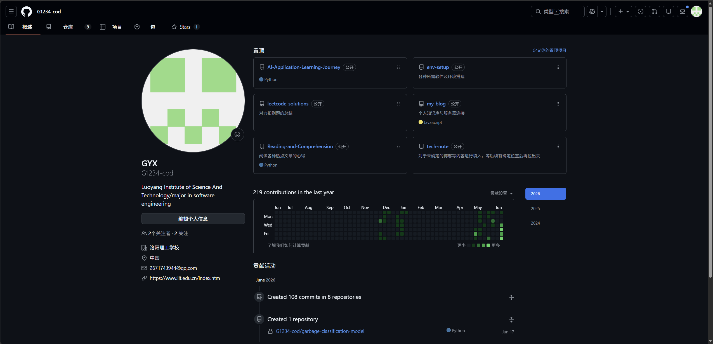
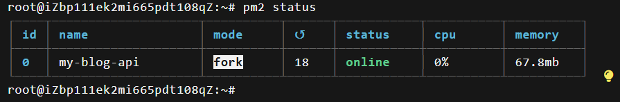
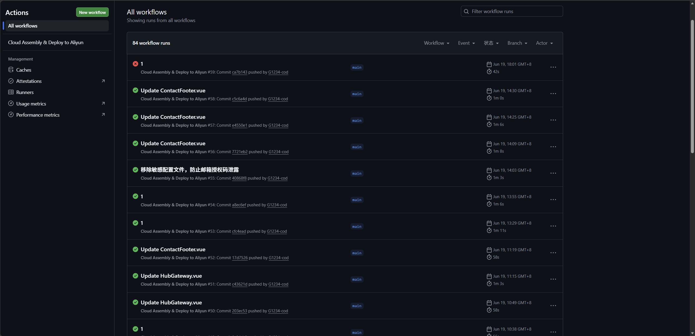

<ProjectHero 
  title="双引擎全栈技术门户系统"
  subtitle="CLOUD-NATIVE JAMSTACK PORTAL & CI/CD"
  date="2026.06"
  role="云原生架构师 & 全栈运维"
  :honors="[
    '云计算技术课程优秀大作业',
    '数据与渲染绝对解耦架构',
    '基于 GitHub Actions 的零宕机流水线'
  ]"
/>

## 💡 突破静态博客的技术中台

传统的单体博客极易陷入“内容与代码极度耦合”的泥潭，且手动命令运维在环境一致性上存在极大局限。本系统（即当前你正在浏览的站点）采用 Jamstack 理念设计，将底层数据知识库（如：学习笔记、简历）与前端呈现引擎在物理层面上彻底剥离，构建了一个多仓库协同运作的数字孪生体。

---

## ⚙️ 全栈双引擎架构与微服务运维

为了实现真正的“云原生”落地，本系统在工程架构上实现了跨网域、跨语言的全栈融合。

  <!-- 使用报告第19页的多仓库物理隔离图 -->
  
  
图 1：支撑主页运行的底层多仓库物理隔离与微服务矩阵

### 1. 自动化流水线 (CI/CD 防雷闭环)
通过编写硬核的 `.github/workflows/deploy.yml` 脚本，彻底解放了生产力：
* **多库挂载聚合**：每次触发构建时，云端容器会自动组装来自 LeetCode、技术笔记、AI 学习等多个独立子仓库的代码碎片，映射至主引擎目录。
* **自动化安全投递**：全量编译后，通过 SCP/SSH 协议并基于 GitHub 加密 Secrets，自动清空阿里云服务器旧产物并同步新资源，达成真正的零宕机静默发布。

  <!-- 使用你上传的 image_934a9e.png -->
  
  
图 2：基于 GitHub Actions 的零干预多仓库聚合与自动化部署

### 2. Node.js 后端与 Nginx 网关策略
不仅有静态前端，系统还在阿里云宿主机上拉起了独立的 `Node.js + Express` API 微服务，以处理动态的邮件分发与表单提交。
* **反向代理与端口收敛**：配置 Nginx 屏蔽内部脆弱的 3000 端口，通过 `/api/` 路由进行底层请求的无缝转发，彻底消灭了 HTTPS 环境下的混合内容（Mixed Content）与跨域（CORS）安全拦截。
* **守护进程与安全熔断**：借助 `PM2` 进程管理工具实现后端服务的挂机守护与崩溃自启；并在中间件层内置了速率熔断（15分钟/3次限制）与严格 IP 白名单，有效防御恶意爬虫脚本对邮件 API 的轰炸探测。

  <!-- 使用你上传的 image_934a3d.png -->
  
  
图 3：Node.js 后端微服务 PM2 进程守护与实时监控面板

---

> 💡 **架构与开源说明**：
> 本站底层采用真实的微服务架构与企业级自动化运维标准搭建。受限于篇幅，部分 Nginx 底层路由配置文件、Nodemailer 邮件引擎核心源码及跨域防御拦截策略未完全展出。全站源码（含 CI/CD 脚本与 Vue 组件层）均已在云端开源，欢迎通过页面右上角的 GitHub 图标查阅完整的工程细节。