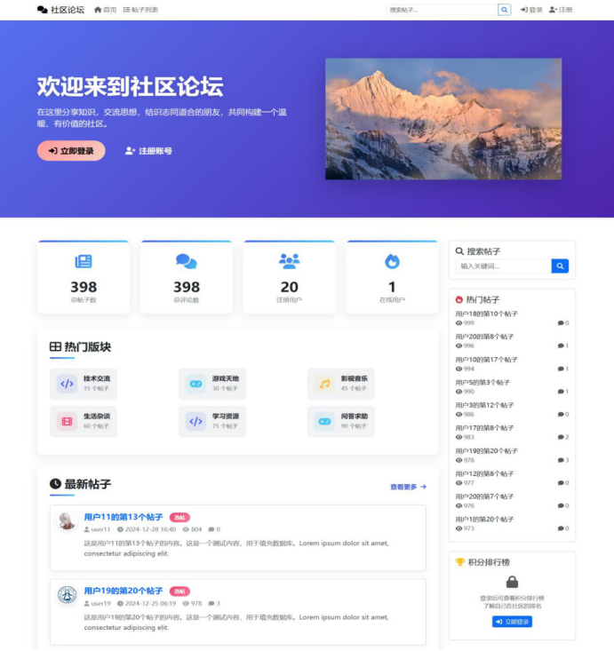
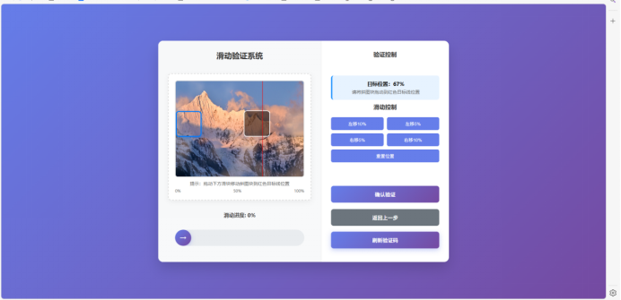
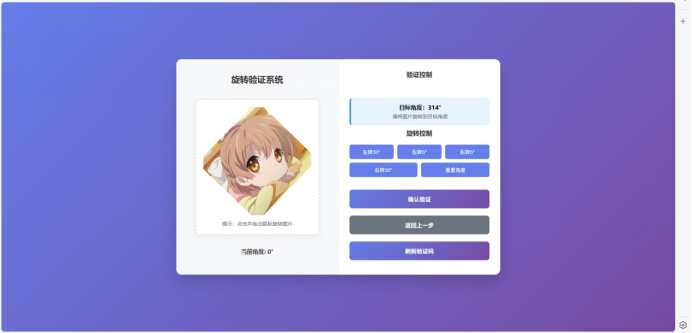
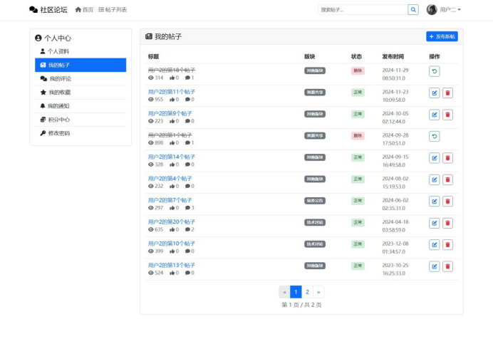
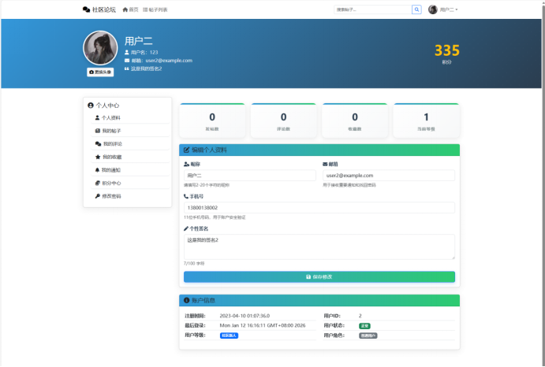
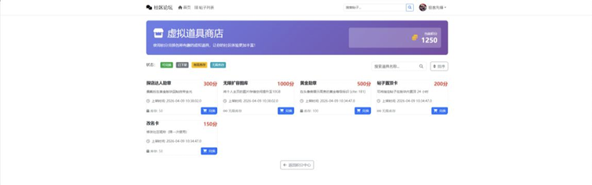
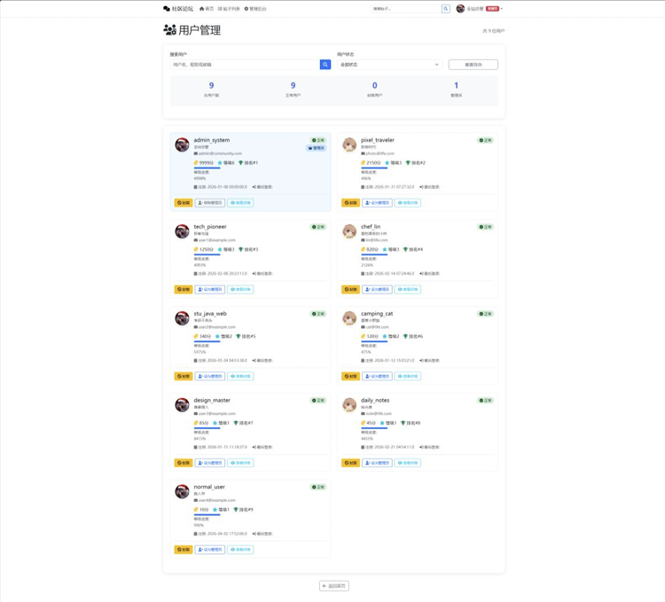

<ProjectHero 
  title="基于双重验证机制的社区互动系统"
  subtitle="SECURE COMMUNITY INTERACTION SYSTEM"
  date="2026.02 - 2026.04.08"
  role="后端安全架构 & 核心鉴权研发"
  :honors="[
    '国家版权局软件著作权登记 (三人联名)'
  ]"
>
  

## 💡 业务背景与 Web 安全痛点

随着 Web 社交生态的繁荣，社区平台面临着自动化爬虫、撞库攻击（Credential Stuffing）与非法内容注入等多重威胁。传统的单点登录与基础权限校验，在涉及“虚拟资产流转”的高频交互场景下已无法满足保护需求。

本项目作为一个高安全等级的 Web 防护试验田，基于原生 JavaWeb 技术栈（Servlet 4.0 规范）、MVC 设计模式以及底层的过滤器链（Filter Chain）机制，着力解决社区环境下的越权漏洞与资产防篡改问题。

---

## 🛡️ 核心安全引擎与双重验证 (2FA)

系统抛弃了将权限校验散落于业务代码中的初级做法，在中间件层面构建了极其严密的全局防御体系。

### 1. 多模态交互式双重验证
在常规密码校验的基础上，系统在登录与核心资产变更节点，利用后端 `Captcha_Make` 工具类强制触发二次动态验证机制。系统支持：
* **交互式滑动拼图验证**：后端动态裁剪局部块并在背景图留白，前端拖拽后，系统调用 `validatePosition` 校验偏移坐标与后端记录的差值是否在容差范围内。
* **空间旋转角度验证**：通过干扰线与坐标旋转生成复杂验证机制，有效抵御 OCR 脚本自动化攻击。

  
  
  
图 1：系统内置的多模态交互式双重验证引擎

### 2. 全局拦截器与防脱敏过滤
设计了底层的路由守卫与鉴权中间件。通过 `AdminFilter` 实施全站权限拦截，对非授权访问执行毫秒级重定向响应；同时利用全局 `CharacterEncodingFilter` 执行敏感字符清洗，保障大规模纯文本数据的并发存取安全。

---

## 🔁 社区内容分发与资产流转中枢

系统不仅是一个防御堡垒，更提供了一套完整的内容与积分生命周期管理机制。

### 1. 响应式内容交互与逻辑删除
首页通过 `PostDao.findLatestPosts` 分页拉取社区动态，并由 AJAX 实现无刷新数据提交。在用户执行内容删除时，系统严格遵循“逻辑删除”原则，仅将状态字段置为隐藏，确保数据的可追溯性。

  
  
图 2：个人贴子生命周期管理与数据流转

### 2. 原子化积分结算引擎 (ACID)
针对用户的签到、发帖、点赞等高频行为，系统内置了精细化的积分核算引擎（`PointsService`）。
在“积分商城”兑换虚拟道具时，系统在同一个数据库事务（Transaction）内严格执行“扣减用户积分”与“写入兑换记录”操作。若任一环节失败则全案回滚，彻底杜绝了高并发下的资产超发问题。

  
  
  
图 3：基于用户活跃度的数字化积分资产管理与兑换

---

## 👁️ 全站运行审计与后端管控

为确保社区运营的法理合规与操作溯源，系统在底层构建了自动化状态监控与用户管理模块。

* **运行态监听**：通过 `SessionListener` 实时统计在线用户数及会话生命周期。
* **用户生命周期管控**：管理员可通过后台看板进行全局账号的高维管理与封禁调度。

  
  
图 4：后台用户管理大盘与全链路状态监控

---

> 💡 **系统完整性说明**：
> 限于展示篇幅，本页仅截取核心安全验证与高频交互界面。系统实际上还包含完整的找回密码流、多表关联查询引擎、系统运行监控以及基础的 CRUD 等多个功能视窗。完整系统运转细节，欢迎通过左侧导航栏查阅对应的 GitHub 源码库。