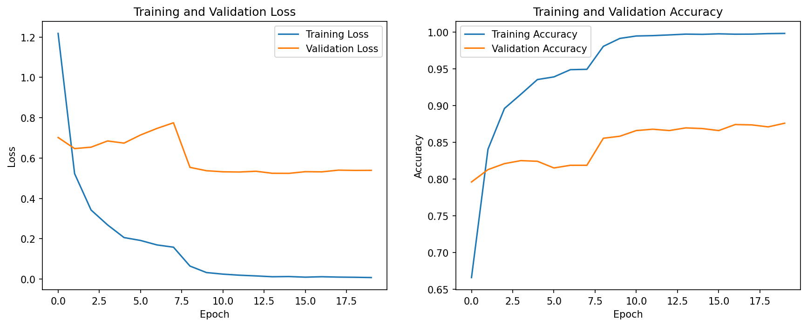
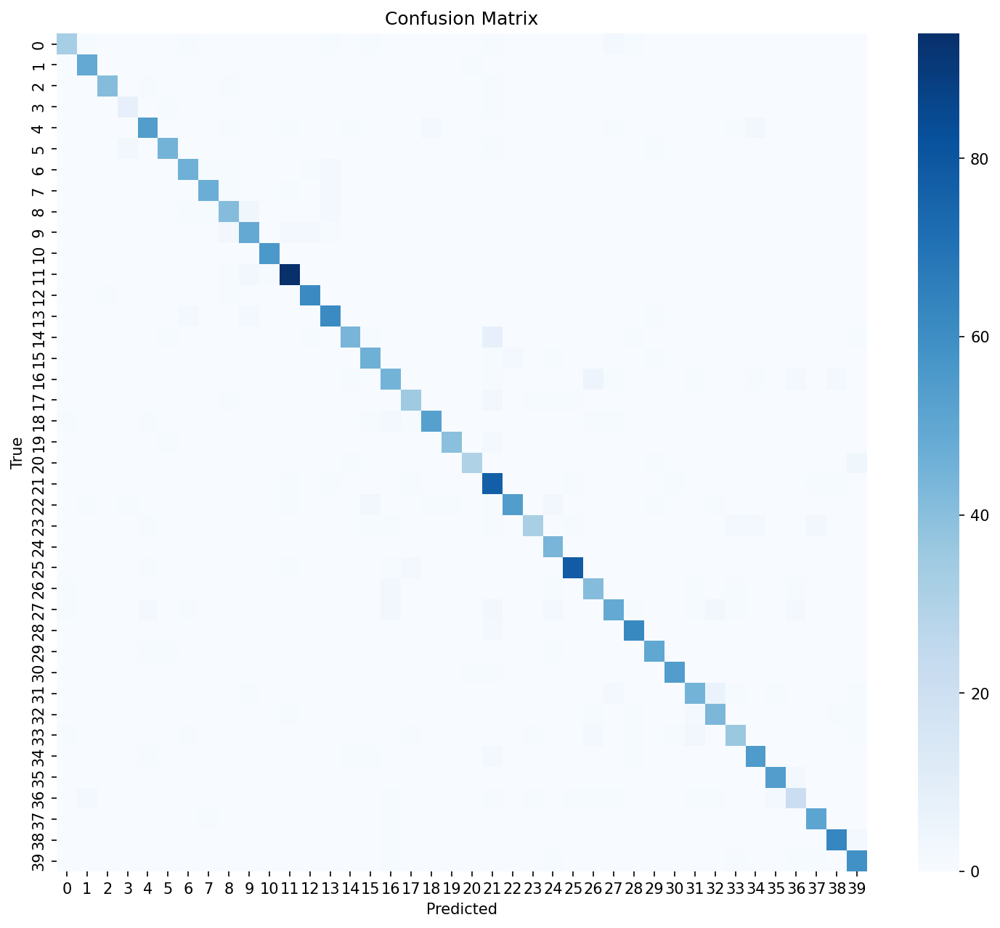
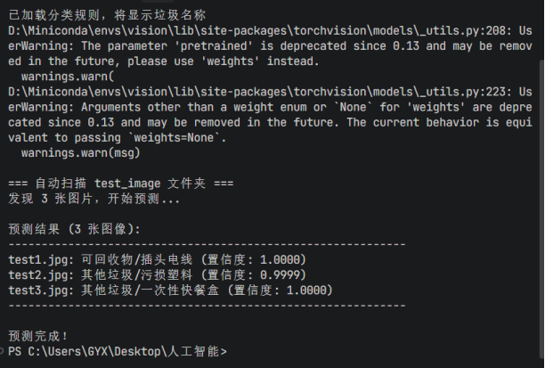

<ProjectHero 
  title="基于深度学习的垃圾分类视觉底座"
  subtitle="AI IMAGE CLASSIFICATION ENGINE"
  date="2026.06"
  role="深度学习模型训练与工程架构"
  :honors="[
    '人工智能技术课程优秀设计',
    '长尾分布对抗与多模型横评实践'
  ]"
/>

## 💡 产业背景与长尾分布痛点

在智慧城市与智能环卫场景中，垃圾图像分类面临极其严峻的挑战。除了光照突变、背景杂乱干扰外，真实数据集中普遍存在**长尾分布（类别极度不平衡）**的致命难题：某些常见垃圾样本极多，而生僻垃圾样本极少。
本项目基于真实场景下的 40 类别、14000 余张图像，利用 PyTorch 框架构建了一个具备高鲁棒性与强泛化能力的计算机视觉识别底座。

---

## ⚙️ 核心技术栈与工程化解耦

不同于初学者将所有代码塞入单一脚本的陋习，本项目在底层架构与算法策略上进行了全方位的工业级优化。

### 1. 迁移学习 (Transfer Learning) 与多架构融合
利用 ImageNet 预训练权重作为特征提取器的先验知识，加速模型收敛并提升泛化下限。通过修改全连接层（Classifier Head）以适配 40 分类的输出维度，实现了深层特征的降维与精确映射。

### 2. 工厂设计模式 (Factory Pattern)
在工程代码架构上实现了**严格的模块化解耦**：配置字典、数据加载器 (DataLoader)、模型定义、训练调度完全物理分离。支持在终端一键切换并加载不同网络拓扑，极大提升了模型对比与迭代的效率。

### 3. 长尾对抗与早停防御机制
* **动态数据增强**：运用随机旋转、裁剪、色彩抖动等增强算子，扩充尾部类别样本空间。
* **AdamW 与 Early Stopping**：引入具备权重衰减特性的 `AdamW` 优化器，并部署 `Early Stopping`（早停）监控验证集 Loss。在模型即将发生过拟合时自动熔断并保存最优权重（`best_model.pth`）。

---

## 📊 四大深度神经网络横向评测

为了确立应对复杂环卫场景的最佳模型，本项目严格控制超参数变量，对四大主流深度学习网络进行了交叉横评。

| 模型架构 | 参数量级 (Params) | 核心特性与应用场景 | 验证集准确率 (Acc) | 最佳收敛 Epoch |
| :--- | :--- | :--- | :--- | :--- |
| **SimpleCNN** | 极小 | 基础基线模型，验证数据连通性 | 填入准确率% | - |
| **ResNet18** | 中等 (残差连接) | 缓解梯度消失，工业界高性价比首选 | 填入准确率% | - |
| **MobileNet-V2** | 轻量级 (深度可分离卷积) | 专为边缘计算与移动端推理设计 | 填入准确率% | - |
| **EfficientNet-B0** | 复合缩放 (最佳权衡) | 自动平衡深度、宽度与分辨率，精度最高 | 填入准确率% | - |

*(注：请结合实验报告，将表格中的准确率与收敛轮数补充完整)*

---

## 📈 训练动态与评估指标可视化

模型的优秀不仅体现在最终的准确率上，更体现在其稳定收敛的动态过程与对易混淆类别的区分能力上。

### 1. 训练与验证收敛曲线 (Training History)
从损失函数（Loss）与准确率（Accuracy）的走势可以看出，得益于早停机制与学习率衰减，模型在训练中后期未出现明显的过拟合（震荡扩散）现象，泛化间隙被压缩至最小。

  
  
图 1：模型训练动态走势与泛化间隙监控

### 2. 高维混淆矩阵分析 (Confusion Matrix)
通过对 40 个类别的测试集推理结果生成混淆矩阵，可以直观定位模型的“认知盲区”。对角线的高亮表明模型在绝大多数类别上判断极度准确；对于非对角线的散点分布，则为下一阶段的数据定向增强（Data Augmentation）提供了靶向数据。

  
  
图 2：测试集 40 分类高维混淆矩阵与误判热力图

---

## 🏆 终端自动化推理验证

最终编译打包的模型权重，已成功挂载至本地推理脚本。在纯命令行的自动扫描测试中，模型能在毫秒级时间内准确输出预测类别（如：可回收物/插头），完全具备下发至边缘算力设备（如智能垃圾桶树莓派）进行部署的工程条件。

  
  
图 3：终端命令行自动推理与视觉分类结果

