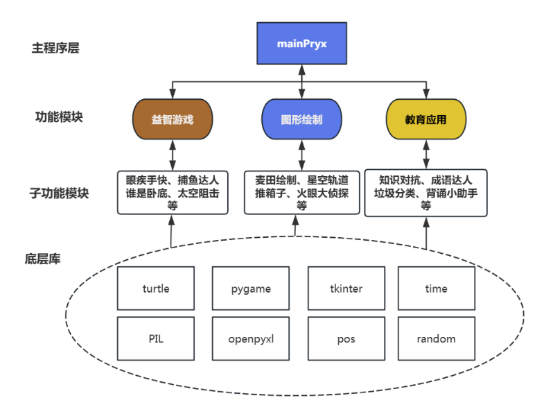
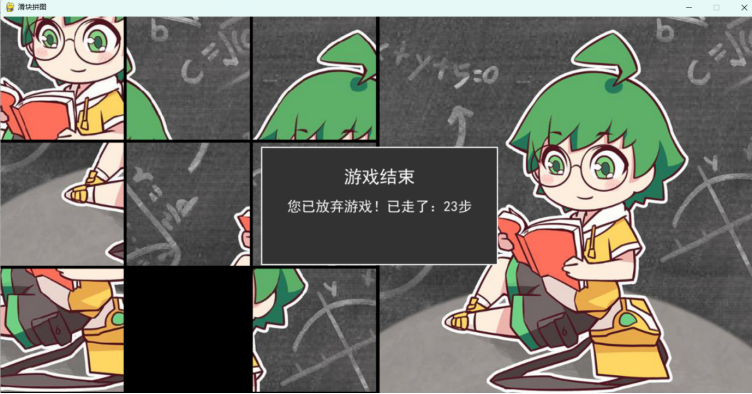

<ProjectHero 
  title="多功能图形用户工具集系统"
  subtitle="PYTHON MULTIFUNCTIONAL GRAPHICS SUITE"
  date="2025"
  role="跨库渲染开发 & 模块化架构"
  :honors="[
    '国家版权局软件著作权登记'
  ]"
>
  
</ProjectHero>

## 💡 开发背景与教育赋能

针对编程初学者学习 Python 时面临的“控制台黑框枯燥、缺乏视觉正反馈”的痛点，本项目以极客精神打造了一款集成益智游戏、图形动态绘制与教育应用为一体的桌面级可视化大本营。这不仅是一个应用，更是 Python 桌面级 GUI 与事件驱动教学的优秀实践范本。

---

## ⚙️ 跨引擎渲染解耦与模块化架构

系统在工程设计上坚持了严密的“高内聚、低耦合”原则，保证了代码的可维护性与模块的可插拔性。

### 1. Turtle 与 Pygame 的底层融合
* 突破了单一图形库的性能瓶颈与渲染限制，创新性地将 `Turtle`（长于矢量计算、分形动态绘制）与 `Pygame`（长于高帧率游戏循环、复杂精灵树管理）进行底层融合集成。
* 根据不同子模块的计算需求，智能调度图形渲染管线，在极低的硬件资源占用下提供了丝滑的交互体验。

  
  
图 1：多功能图形系统四层解耦架构与底层渲染逻辑

### 2. 四层核心功能矩阵
系统采用严格的模块化解耦，各功能插件即插即用：
* **益智游戏模块**：处理复杂的事件轮询与 2D 碰撞检测算法（涵盖飞机射击游戏、数字记忆训练等）。
* **图形绘制模块**：支持用户参数化输入，自动利用几何算法生成复杂分形与动态视觉图形。
* **教育应用模块**：内置寓教于乐的交互式学习组件，降低了编程初学者的入门门槛。

  
  
图 2：基于高帧率循环与矢量引擎的动态渲染展示

---

## 🛠️ 异常防御与生产级容错机制

区别于脆弱的学生玩具项目，本系统在 I/O 层面与用户交互层设计了对标商业软件的健壮防御体系：

* **全局资源依赖校验**：系统要求 Python 3.6+ 环境，在首次启动时会进行底层库依赖与分辨率（1024x768 最小自适应）的自动探针检测。
* **细粒度异常错误码引擎**：定义了详尽的报错降级方案。例如拦截 `ERROR_DATA_003`（JSON/TXT配置文件损坏或编码错误）、`ERROR_INPUT_004`（如栅栏密码输入空文本异常），并在终端或 GUI 同步输出对应的 Traceback 日志。
* **沙盒式日志收集**：在根目录静态生成 `toolset_log.txt`，静默记录系统启动耗时、功能执行流及崩溃堆栈，为后续的迭代修复提供了精准的调试锚点。

---

## 🏆 项目证书与最终成果

  
  
图 3：国家版权局软件著作权登记证书

> 💡 **系统完整性说明**：
> 限于展示篇幅，本页仅截取了核心架构逻辑与系统主界面。系统实际上还包含基于 Pygame 的多种高帧率飞行射击关卡、基于 Turtle 的复杂分形几何动态绘制、以及栅栏密码等加密算法的交互式教学模块。完整源代码、资源依赖及执行流日志，欢迎通过左侧导航栏查阅对应的 GitHub 源码库。