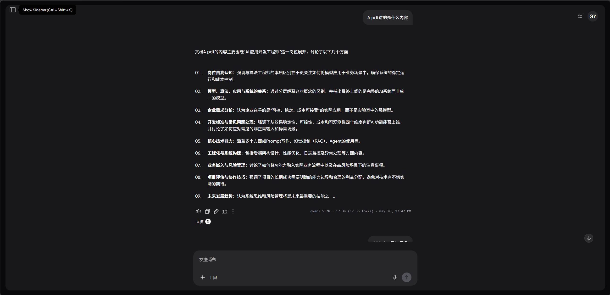
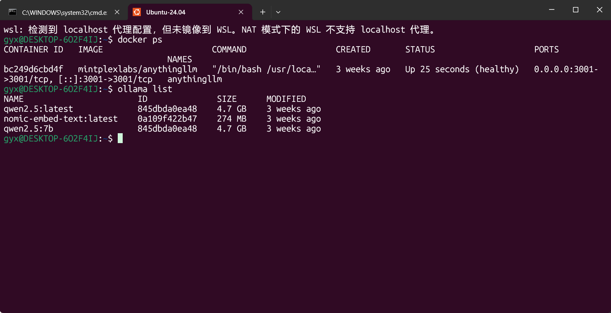

<ProjectHero 
  title="基于 AnythingLLM 的私有化 RAG 知识库"
  subtitle="LOCAL RAG KNOWLEDGE BASE & AI AGENT"
  date="2026.05 - 2026.06"
  role="AI 工程化与私有化容器部署"
  :honors="[
    '纯内网物理隔离部署实践',
    '基于 Docker + WSL2 的微服务架构'
  ]"
/>
  

## 💡 为什么需要“数据不出内网”的 AI？

随着大模型能力的爆发，将个人高价值笔记、企业技术白皮书等高敏数据上传至云端模型 API 面临着严重的数据泄露与合规风险。
本项目旨在通过**完全本地化、断网可用**的架构，利用 RAG（检索增强生成）技术，让 AI 在安全沙盒内精准“读懂”本地知识库。

---

## ⚙️ 容器化与网络互通架构

为了保证宿主机的纯净，系统彻底抛弃了脆弱的直装模式，采用 **WSL2 (Ubuntu) + Docker** 构建标准的云原生基建环境。

### 1. 模型底座与应用层绝对解耦
* **底层推理引擎 (Ollama)**：作为无状态的纯后台服务运行在宿主机，负责加载与显存调度 `qwen2.5` 等开源大语言模型，提供兼容 OpenAI 格式的底层 API。
* **RAG 交互层 (AnythingLLM)**：通过 Docker 独立挂载部署，负责处理复杂的文档解析切片（Embedding）、内置向量数据库检索调度与前端 UI 对话呈现。

### 2. Docker 复杂网络穿透与配置分离
打通了宿主机与容器群的内部网络。通过精准配置 `.env` 环境变量与 `host.docker.internal:11434` 网关映射，实现了 AnythingLLM 容器对宿主机 Ollama 引擎的无延迟穿透调用，彻底解决了 WSL2 虚拟网卡带来的网络隔离痛点。

---

## 🧠 数据流与业务闭环

用户在前端提问 ➡️ 系统调用本地 Embedding 模型将问题向量化 ➡️ 查询绑定的挂载卷 (Volumes) 中的文档索引 ➡️ 提取最相关的 Markdown/PDF 碎片 ➡️ 将碎片与问题拼接为复合 Prompt ➡️ 喂给 Ollama 推理出精确答案。
整个链路**完全隔离公网，实现了零数据外发**的高级别隐私保护。

---

## 🏆 工程落地与运行状态

  
  
图 1：WSL2 宿主环境下的容器化微服务运行态与大模型底座

> 💡 **架构完整性说明**：
> 限于展示篇幅，本页仅截取了 RAG 业务流与底层容器挂载状态。系统内部实际上还配置了基于 Workspace 的多工作区权限隔离、自定义 System Prompt 角色设定、以及不同的 Embedding 文本切片策略配置。底层全链路搭建过程与排坑复盘笔记，欢迎通过左侧导航栏查阅对应的 GitHub 技术文档仓库。