

<ProjectHero 
  title="拍一张照片，AI 帮你搞定二手商品发布"
  subtitle="INTELLIGENT SECOND-HAND GOODS PUBLISHING ASSISTANT"
  date="2026.06"
  role="AI 全链路集成与工程落地"
  :honors="[
    '毕业设计作品',
    '全栈 AI 应用实战'
  ]"
/>

  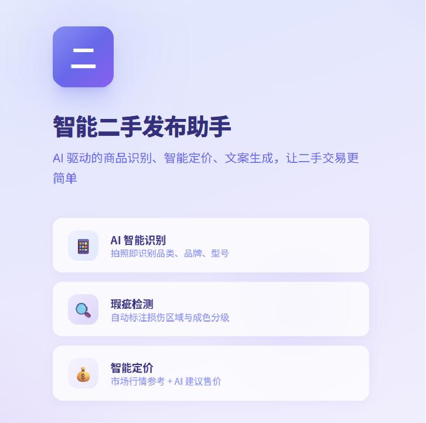
  
图 1：商品发布核心流程界面 —— 上传图片即可触发 AI 全链路处理

## 💡 项目背景与核心痛点

随着二手交易市场的蓬勃发展，普通用户发布闲置物品面临四大核心痛点：不知道卖多少钱、不会写商品描述、看不出商品瑕疵、搜不到相似商品。本项目致力于通过 AI 技术，让用户**只需要拍一张照片**，剩下的识别、查价、检测、定价、写文案全部由 AI 自动完成。

**传统做法 vs 本项目：**

| 痛点 | 传统做法 | 本项目 |
|------|---------|--------|
| 不知道卖多少钱 | 手动去闲鱼/转转翻半天比价 | AI 自动查市场行情 + 智能定价 |
| 不会写商品描述 | 绞尽脑汁想文案、怕漏关键信息 | AI 自动生成专业带货文案，逐字流出 |
| 看不出商品瑕疵 | 肉眼检查，容易遗漏或夸大 | YOLOv8 分割模型自动检测 7 类缺陷 |
| 搜不到相似商品 | 纯文字搜标题，匹配不准确 | 以图搜图，上传图片直接找到最像的商品 |

---

## ⚙️ 技术架构与核心能力

### 1. 五层分层架构

系统采用清晰的五层架构设计：

- **用户层**：Vue 3 SPA，包含发布页、商城页、搜索页、历史页等 9 个页面
- **接入层**：开发环境 Vite Dev Server，生产环境 Nginx 反向代理
- **应用层**：FastAPI + Uvicorn ASGI Server，13 个路由模块
- **AI 模型层**：YOLOv8（本地）、CLIP ViT-B-32（本地）、Qwen-VL-Max（云端）、DeepSeek（云端）
- **数据层**：MySQL 8.0（11 张业务表）、Qdrant 向量数据库、本地文件存储

### 2. AI 双模型协同识别

系统创新地采用"本地 YOLO + 云端 Qwen-VL"双模型并行识别策略：

- **YOLOv8**：本地轻量检测，80 类 COCO 预训练，快速识别物品类别和位置
- **Qwen-VL-Max**：阿里云百炼千亿参数多模态大模型，实现结构化识别（品类/品牌/型号/成色）
- **双模型比对**：结果不一致时自动存入错题本，用于后续模型训练优化

### 3. 瑕疵检测与分级体系

基于 YOLOv8-seg 分割模型实现像素级缺陷检测：

- **7 类 Kaputt 缺陷**：穿透、变形、功能故障、结构损坏、溢漏、表面瑕疵、部件缺失
- **4 级严重程度**：重度（红色圆形）、中度（橙色矩形）、轻度（金色多边形）、轻微（蓝色虚线）
- **智能定价推理**：瑕疵程度作为 DeepSeek 定价的关键输入参数

  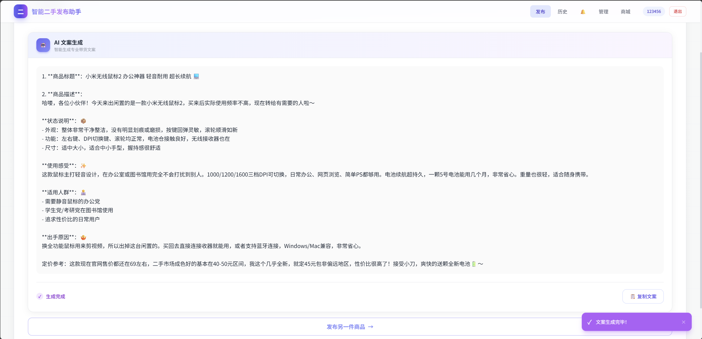
  
图 2：YOLOv8-seg 自动检测商品瑕疵并分级标注（红色重度/橙色中度/金色轻度/蓝色轻微）

### 4. 以图搜图引擎

基于 CLIP + Qdrant 构建强大的图文检索能力：

- **CLIP ViT-B-32**：512 维语义向量，实现图文统一语义空间映射
- **Qdrant**：HNSW 索引 + COSINE 相似度，毫秒级检索响应
- **双模式搜索**：以图搜图（上传图片找相似）+ 以文搜图（输入描述找匹配）

  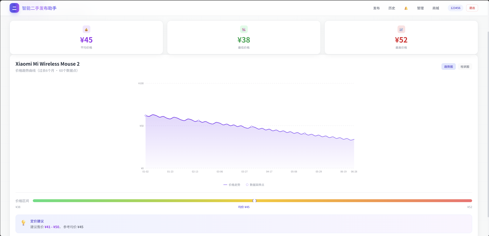
  
图 3：以图搜图功能 —— 上传图片即可找到视觉上最相似的二手商品

---

## 🧠 核心业务流程

### 商品发布全链路（用户仅需 3 次点击）

1. **上传图片** → 系统自动执行 6 步预处理管道（缩放→去背景→去噪→亮度增强→对比度→锐化）
2. **AI 识别** → YOLO + Qwen-VL 并行推理，自动识别品类/品牌/型号/成色
3. **瑕疵检测** → YOLOv8-seg 自动检测缺陷并分级标注
4. **市场查价** → 三层匹配策略（精确→模糊→空）查询二手市场均价
5. **智能定价** → DeepSeek 结合瑕疵程度与行情数据推理建议售价
6. **生成文案** → SSE 流式输出，打字机效果逐字呈现
7. **一键发布** → MySQL 事务保存 + Qdrant 向量自动索引

  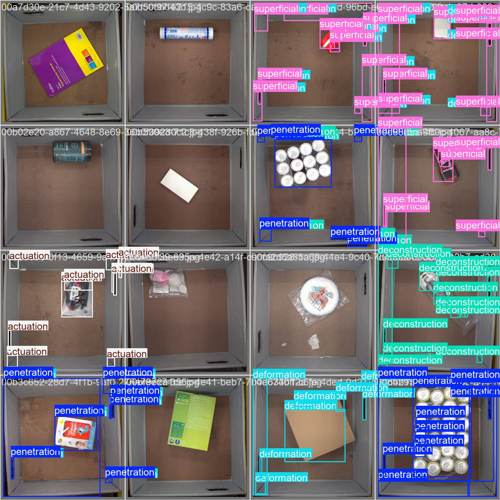
  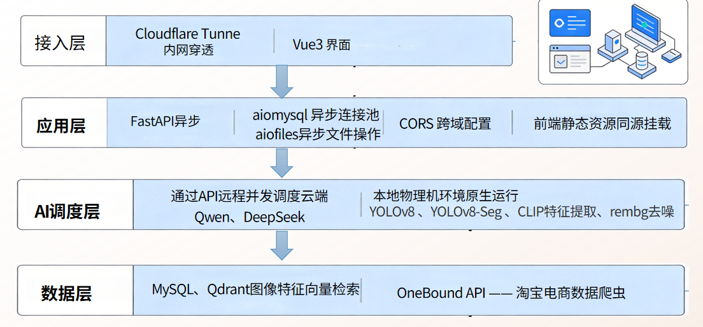
  
图 4：AI 识别结果与 SSE 流式文案生成（打字机效果逐字呈现）

---

## 🏆 技术亮点

| 技术能力 | 实现方案 | 价值 |
|---------|---------|------|
| SSE 流式文案 | DeepSeek 流式 API + ReadableStream + requestAnimationFrame 节流 | 打字机效果，用户体验流畅 |
| 数据飞轮闭环 | YOLO/Qwen 结果比对 → 错题本 → 每周自动训练 → 模型迭代 | 系统持续自我进化 |
| 滑动窗口限流 | 按端点独立限流（注册 5/min、登录 10/min、识别 10/min） | 防恶意高频请求 |
| 密码安全 | PBKDF2-SHA256，16 字节随机盐，10 万次迭代 | 防彩虹表、防暴力破解 |
| 文件上传安全 | MIME 校验 + PIL 解码验证 + 路径遍历防护 | 防恶意文件上传 |

---

## 💻 技术栈

| 层级 | 技术 | 说明 |
|------|------|------|
| 后端框架 | Python 3.11 · FastAPI · Uvicorn | 异步 Web 框架，原生 async/await |
| 数据库 | MySQL 8.0 · aiomysql | 异步连接池，11 张表 |
| 向量搜索 | Qdrant · CLIP ViT-B-32 | 512 维语义向量，COSINE 相似度 |
| 前端 | Vue 3 · Vite · TailwindCSS · Axios · Chart.js | Composition API，ESM 原生热更新 |
| AI 大模型 | DeepSeek · Qwen-VL-Max | 文案生成+定价+视觉识别 |
| 目标检测 | YOLOv8 (ultralytics) | 分类 + 实例分割（7类缺陷） |
| 认证安全 | JWT · PBKDF2 · 滑动窗口限流 | 无状态认证 + 加盐哈希 + 速率保护 |

---

## 🚀 系统功能展示

### 商城系统与用户交互

  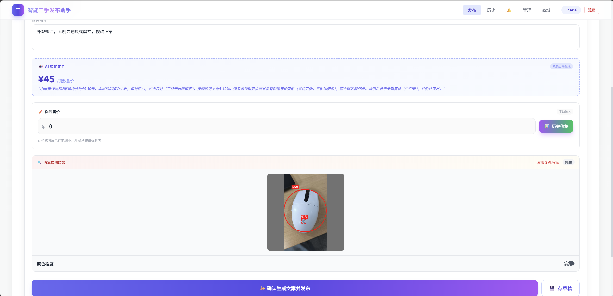
  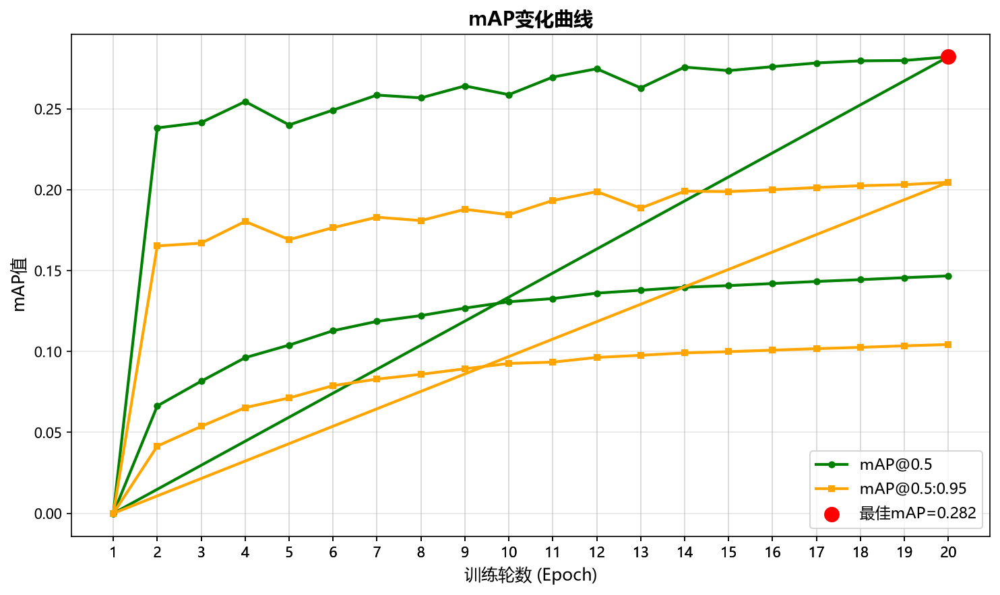
  
图 5：商城列表与商品详情页面

### 个人中心与价格分析

  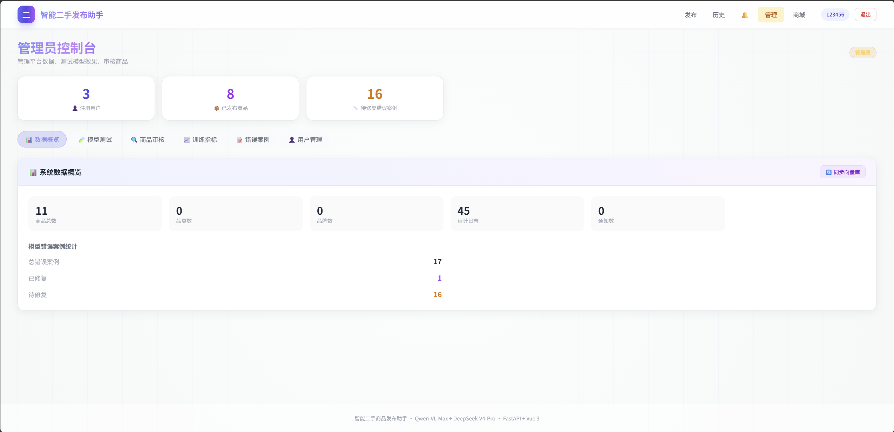
  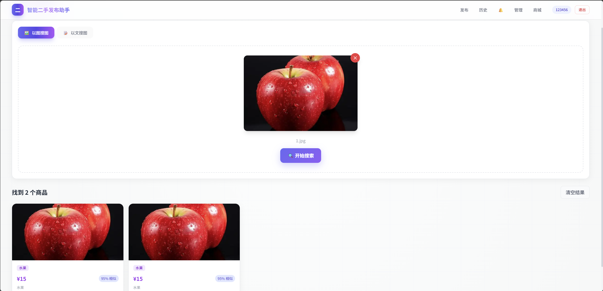
  
图 6：个人中心与价格历史分析图表（Chart.js 可视化）

### 管理后台与系统监控

  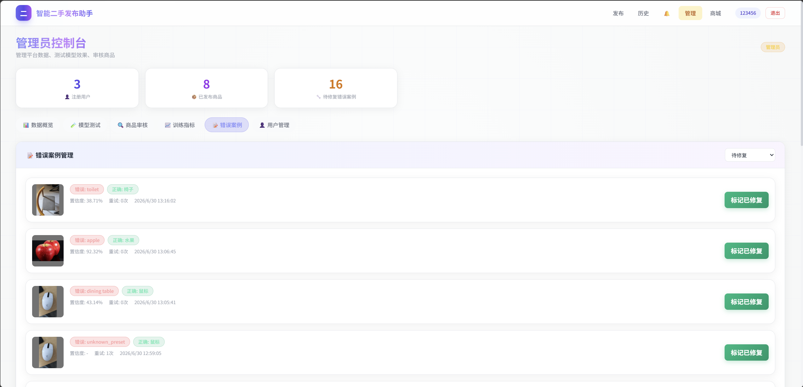
  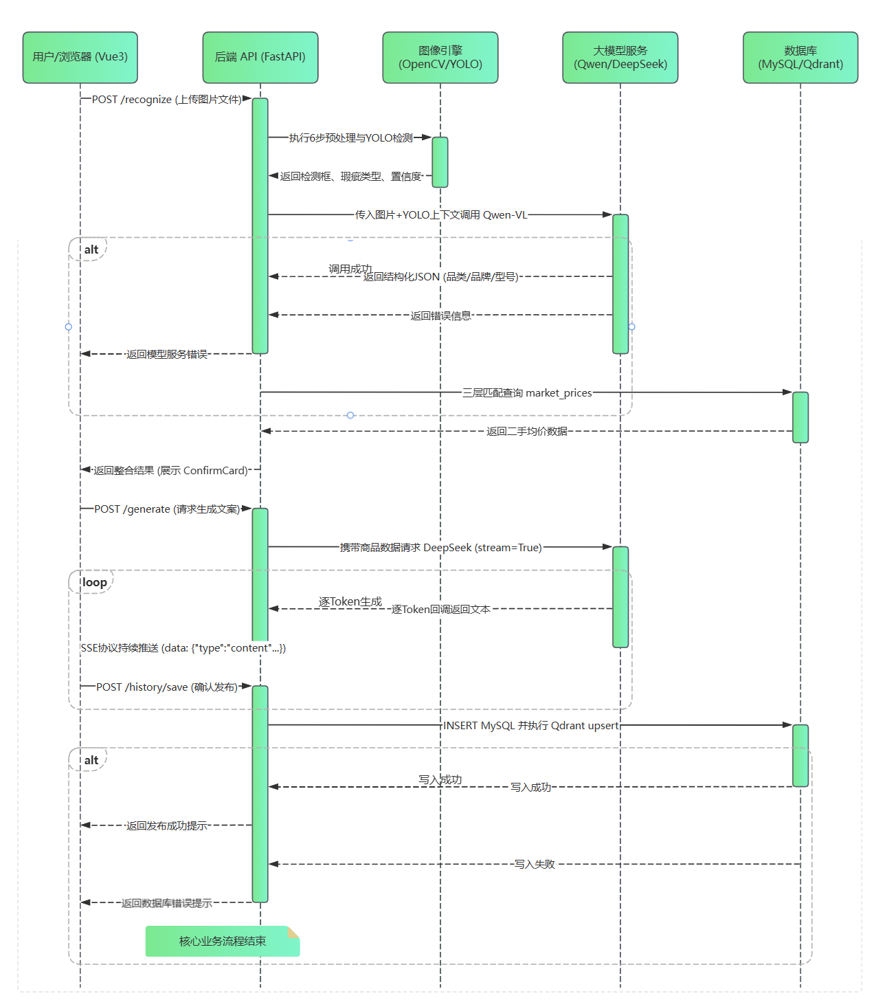
  
图 7：管理员面板与系统统计数据

---

## ✅ 运行状态

系统已完成全部功能开发，包含：
- 9 个前端页面（登录/注册/发布/商城/搜索/历史/通知/管理/价格历史）
- 13 个后端路由模块
- 8 个业务服务层
- 29 个 pytest 测试用例全部通过
- 完整的 Docker + Qdrant 容器化部署方案

> 💡 **系统完整性说明**：
> 限于展示篇幅，本页仅截取核心技术架构与业务流程。系统实际上还包含完整的管理员面板、通知中心、价格历史图表、审计日志、每周自动训练流水线等功能模块。完整源码与详细文档，欢迎通过左侧导航栏查阅。