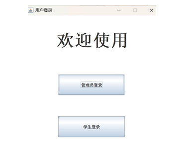
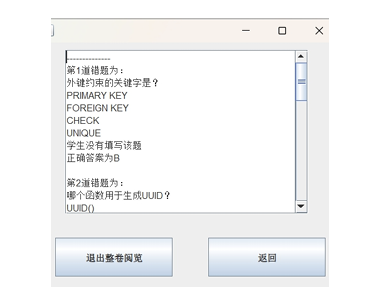
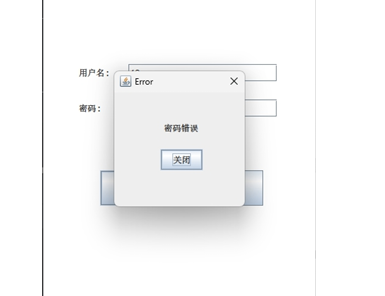

<ProjectHero 
  title="在线考试考务与数据分析系统"
  subtitle="ONLINE EXAM MANAGEMENT SYSTEM"
  date="2026.04 - 2026.05"
  role="全栈 Java 开发 & 系统架构设计"
  :honors="[
    '国家版权局软件著作权登记'
  ]"

<!--  -->

</ProjectHero>

## 💡 项目背景与教务痛点

在传统的校园与教培机构日常考务管理中，线下考试面临着极高的组织成本。从前期的排考、纸质试卷印制，到后期的纯人工阅卷，不仅耗费大量人力物力，且难以对考试成绩进行深度的离散度与极值分析。

本项目致力于打造一款**全链路、高并发、防作弊**的自动化考务平台，旨在通过信息化手段实现教学质量的精准评估与考务流程的降本增效。

---

## ⚙️ 核心架构与 RBAC 权限引擎

系统底层采用了经过工业界长期检验的经典 **Java Web (Servlet/JSP) + MVC** 架构，配合强一致性的关系型数据库，确保在百人并发交卷场景下的数据绝对安全与零丢失。

### 1. RBAC 物理级权限隔离
在系统设计初期，我们便引入了严格的基于角色的访问控制（RBAC）模型，将全站权限切割为三大物理隔离的沙盒环境：
* **超级管理员 (Admin)**：掌控全局账号生命周期、考试场次宏观调配与基础题库的底层维护。
* **教师端 (Teacher)**：支持题目的增删改查（CRUD）、试卷参数自定义组装（如设置考试时长、总分阈值）及班级成绩面板监控。
* **学生端 (Student)**：提供沉浸式防切屏考试环境、历史成绩可视化追踪以及智能错题本系统。

---

## 📊 自动化阅卷与极值数据分析

摒弃了传统考试系统“只管考不管析”的弊端，本系统在后端引入了一套轻量级的数据分析引擎：

### 1. 毫秒级自动判分与极值提取
* 针对单选、多选、判断等客观题，系统在学生提交试卷的瞬间触发底层比对算法，实现毫秒级自动判分。
* 系统支持一键提取单场考试的**最高分极值、平均分以及错题率 Top 5**，为教师调整后续教学计划提供坚实的数据支撑。

### 2. 智能错题本与整卷阅览追踪
系统会自动为每位考生生成动态的错题知识图谱。在考后复盘阶段，学生可通过“整卷阅览”功能，直观对比个人答案与标准答案。

  
  
图 1：智能错题解析与整卷阅览追踪引擎

---

## 🛡️ 业务闭环与异常防御机制

在软件工程实践中，系统的健壮性往往体现在对异常边缘场景（Edge Cases）的处理。本系统在接口层与前端交互层设计了极其严密的防御体系。

### 1. 事务级防丢失机制
在网络波动或异常提交（如断网重连、恶意连点交卷）时，后端通过数据库事务（Transaction）保障用户答题记录的原子性操作，杜绝“脏读”与试卷部分丢失灾难。

### 2. 状态码与友好的 UI 降级反馈
根据《用户说明书》，系统针对各类非法操作均设计了明确的降级反馈机制：
* **鉴权拦截**：当输入异常凭据时，系统精准抛出拦截并弹窗提示“认证失败，请重试”。
* **唯一性约束校验**：在后台录入新账户时，自动触发主键唯一性校验，若重复则拦截并提示“账号已存在”。
* **完整性守卫**：题库增删阶段若缺少关键题干信息，触发后端表单校验并提示“请将信息补充完整”。

  
  
图 2：核心业务流中的全局异常拦截与状态反馈

